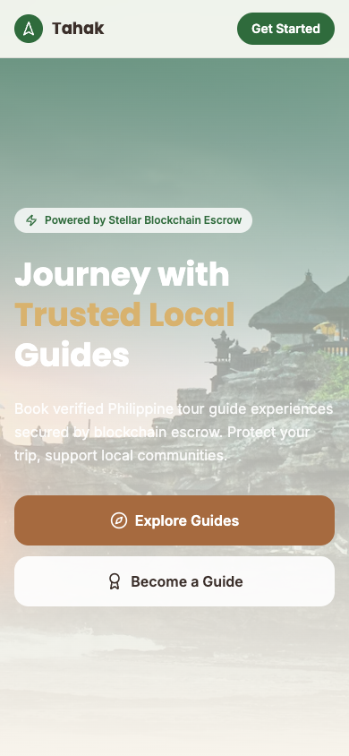
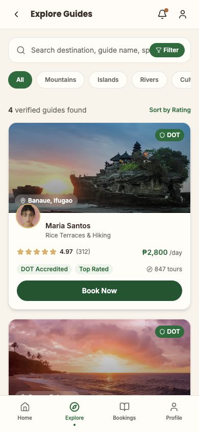
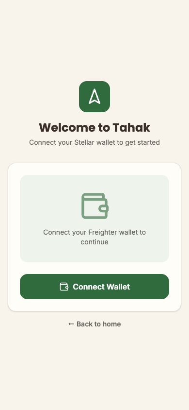

# Tahak 🌿

> **Discover Trusted Local Guides, Secured by Stellar Escrow**
> Giving Filipino tour guides a verifiable, on-chain reputation — and giving travelers a safe way to pay for it.


🌐 **Live App:** [https://tahak-ecru.vercel.app](https://tahak-ecru.vercel.app)
📦 **Repo:** [github.com/caramel-123/tahak](https://github.com/caramel-123/tahak) (public)
🎥 **Demo Video (1–2 min):** _TODO — record a walkthrough (wallet connect → explore guides → booking → contract escrow flow) and link it here_

---

## Deployed Contract (Stellar Testnet)

A real Soroban escrow contract, deployed and invoked end-to-end via the Stellar CLI — no mock, no simulated balances.

| Field | Value |
|-------|-------|
| Contract | `booking_escrow` |
| Address | `CCH6XF6GXFN2K3VHFX6RVTW7SF5U3ZU6QI6SWM3Z5JE5GUZ74FY4KBYD` |
| Wasm hash | `d5f9223041e15550368613e21809b6a3d3f9a36067495d97ae8ff3788a93a597` |
| Escrowed token | Native XLM SAC (testnet) — `CDLZFC3SYJYDZT7K67VZ75HPJVIEUVNIXF47ZG2FB2RMQQVU2HHGCYSC` |

> Verify on Stellar Explorer: [stellar.expert/explorer/testnet/contract/CCH6XF6GXFN2K3VHFX6RVTW7SF5U3ZU6QI6SWM3Z5JE5GUZ74FY4KBYD](https://stellar.expert/explorer/testnet/contract/CCH6XF6GXFN2K3VHFX6RVTW7SF5U3ZU6QI6SWM3Z5JE5GUZ74FY4KBYD)

### Transaction hash for contract interaction

A real booking (`TH2847`, 2.8 XLM — mirroring the ₱2,800 Banaue tour in the app's demo data) was created, funded, and released end-to-end:

| Step | Tx hash |
|------|---------|
| `fund("TH2847")` — 2.8 XLM moves from tourist → contract | [`be826dfda8fec90ff0581ffa2d6e76ef60f156544217578aca5bda6f2d8106ce`](https://stellar.expert/explorer/testnet/tx/be826dfda8fec90ff0581ffa2d6e76ef60f156544217578aca5bda6f2d8106ce) |
| `release("TH2847")` — 2.8 XLM moves from contract → guide | [`ce9b7f9b94efc3a036e72c5eec45770bf88604ae220a8a73530c8b702298c951`](https://stellar.expert/explorer/testnet/tx/ce9b7f9b94efc3a036e72c5eec45770bf88604ae220a8a73530c8b702298c951) |

Full transaction list (deploy, init, create_booking, fund, release) and reproduction steps: [contracts/DEPLOYMENT.md](contracts/DEPLOYMENT.md).

---

## Project Description

Tahak (Tagalog for "journey" or "traverse") is a tour guide discovery, booking, and reputation platform for the Philippines, built on **React + Supabase + Stellar**. Travelers browse DOT-verified local guides by destination, language, and specialty, book a tour, and pay through a Stellar wallet (Freighter) — with payment held in on-chain escrow, released only once the tourist confirms the tour milestone is complete.

Tahak avoids the fintech/crypto-exchange aesthetic on purpose. It's meant to feel like **Airbnb + AllTrails + Google Travel**, with the blockchain doing quiet work in the background rather than being the headline.

---

## Project Vision

Tour guiding in the Philippines runs almost entirely on word of mouth and unverifiable claims — a guide's "500 happy tourists" is just a sentence on a Facebook page. Meanwhile travelers have no recourse if a tour is cancelled, unsafe, or never happened at all, and guides have no way to prove a reputation earned over years of good work.

Tahak's vision is to make that reputation **portable and verifiable**: ratings, completed tours, and DOT/barangay accreditation live as real data a lender, tourist, or tourism officer can check — not a claim on a flyer. Payment protection follows the same logic — funds held in escrow and released against verified milestones, so neither side has to trust the other blindly.

---

## Features

### For Tourists
- 🔎 **Explore Guides** — search and filter by destination, language, price, rating, and specialty (live Supabase data)
- 🪪 **Verification badges** — DOT Accredited, Barangay Certified, Community Vouched, Top Rated
- 👤 **Guide profiles** — bio, languages, specialties, tours, real reviews, fetched per-guide by ID
- 📅 **Bookings dashboard** — Upcoming / Ongoing / Completed, with milestone progress bars
- 📷 **QR Check-In** flow for confirming tour milestones
- 🔐 **Connect Freighter wallet** — real Stellar testnet account connection, no username/password

### For Guides
- 📊 **Guide dashboard** — revenue, escrow-waiting amount, upcoming tours, reputation
- 🗂️ **Manage tours** — create, edit, pricing, availability, gallery
- 📥 **Booking requests** — accept/reject, track milestones, view group members

### For Tourism Officers
- 🗺️ **Regional dashboard** — verified guide counts, open cases, safety alerts
- ⚖️ **Dispute resolution** — review booking timeline, evidence, statements, decide refund / release / split

---

## Mobile Responsive UI

Tested at a 390×844 mobile viewport.

| Landing | Explore Guides |
|---|---|
|  |  |

| Guide Profile | Connect Wallet |
|---|---|
|  |  |

---

## CI/CD Pipeline

GitHub Actions runs on every push/PR to `main`: a frontend job (install → `npm test` → `npm run build`) and a contracts job (`cargo test` against the Soroban contract, wasm32v1-none target). Workflow: [.github/workflows/ci.yml](.github/workflows/ci.yml).


---

## Test Output

**11 tests — all passing**, split across two suites.

### Frontend (Vitest)

```
$ npm test

 RUN  v4.1.10 /Users/melfredbernabe/Desktop/tahak

 Test Files  2 passed (2)
      Tests  7 passed (7)
   Duration  298ms
```

| Test file | Coverage |
|-----------|----------|
| `src/lib/format.test.ts` | `formatPeso()` thousands separators and zero handling, `formatWallet()` address truncation |
| `src/lib/supabase.test.ts` | `guideRowToVM()` — Supabase row → view-model mapping, including null-field fallbacks |

### Smart contract (Cargo)

```
$ cd contracts && cargo test

running 4 tests
test test::test_duplicate_booking_id_fails ... ok
test test::test_release_before_funding_fails ... ok
test test::test_refund_returns_funds_to_tourist ... ok
test test::test_full_escrow_flow_moves_real_token_balances ... ok

test result: ok. 4 passed; 0 failed; 0 ignored; 0 measured; 0 filtered out
```

The `test_full_escrow_flow_moves_real_token_balances` test asserts actual token-client balance changes (not just status flags) as funds move tourist → contract → guide.

---

## Tech Stack

| Layer | Technology |
|-------|-----------|
| Frontend | React 18 + TypeScript + Vite |
| Styling | Tailwind CSS v4 + shadcn/ui |
| Backend | Supabase (Postgres + REST + Row Level Security) |
| Smart contract | Rust / Soroban, deployed on Stellar Testnet |
| Wallet | Freighter ([@stellar/freighter-api](https://www.npmjs.com/package/@stellar/freighter-api)) |
| Balance / tx lookups | Stellar Horizon Testnet API |
| Testing | Vitest (frontend), Cargo test (contract) |
| CI/CD | GitHub Actions |
| PWA | Web manifest + service worker (installable, offline shell caching) |
| Deployment | Vercel |

---

## Wallet Integration

Tahak connects to a **real Freighter wallet** on Stellar Testnet:

1. Detects whether the Freighter browser extension is installed
2. Calls `requestAccess()` so the user approves the connection in Freighter itself
3. Reads the active network via `getNetwork()`
4. Fetches the real XLM balance from `horizon-testnet.stellar.org`

The frontend does not yet call the deployed `booking_escrow` contract directly (bookings are recorded in Supabase; the contract has been proven out independently via the CLI, see above). Wiring `fund`/`release` into the Booking and QR Check-In screens — with Freighter signing the calls — is the next integration step.

---

## Smart Contract Design

```rust
pub fn create_booking(env: Env, booking_id: Symbol, tourist: Address, guide: Address, amount: i128) -> Result<(), Error>;
pub fn fund(env: Env, booking_id: Symbol) -> Result<(), Error>;      // tourist -> contract
pub fn release(env: Env, booking_id: Symbol) -> Result<(), Error>;   // contract -> guide
pub fn refund(env: Env, booking_id: Symbol) -> Result<(), Error>;    // contract -> tourist
pub fn get_booking(env: Env, booking_id: Symbol) -> Option<Booking>;
```

`fund`, `release`, and `refund` move the contract's own balance of the configured token (native XLM on testnet) via `soroban_sdk::token::Client` — this is a real custodian contract, not a status-only tracker. Source: [contracts/booking_escrow/src/lib.rs](contracts/booking_escrow/src/lib.rs).

**Known simplification:** both `release` and `refund` currently require the tourist's signature (tourist confirms completion, or requests a refund). A production version would gate `refund` behind guide agreement or Tourism Officer dispute resolution.

---

## Database Schema (Supabase)

```sql
create table profiles (
  id uuid primary key default gen_random_uuid(),
  wallet_address text unique,
  role text not null check (role in ('tourist', 'guide', 'officer')) default 'tourist',
  full_name text,
  avatar_url text,
  created_at timestamptz not null default now()
);

create table destinations (
  id uuid primary key default gen_random_uuid(),
  name text not null,
  region text not null,
  image_url text,
  guide_count int not null default 0
);

create table guides (
  id uuid primary key default gen_random_uuid(),
  profile_id uuid references profiles(id) on delete set null,
  name text not null,
  location text not null,
  specialty text not null,
  bio text,
  avatar_url text,
  cover_url text,
  rating numeric(3,2) not null default 0,
  review_count int not null default 0,
  tours_completed int not null default 0,
  price_per_day numeric(10,2) not null default 0,
  languages text[] not null default '{}',
  specialties text[] not null default '{}',
  badges text[] not null default '{}',
  verified boolean not null default false,
  created_at timestamptz not null default now()
);

create table tours (
  id uuid primary key default gen_random_uuid(),
  guide_id uuid not null references guides(id) on delete cascade,
  destination_id uuid references destinations(id) on delete set null,
  title text not null,
  duration text,
  group_size text,
  price numeric(10,2) not null default 0,
  included text[] not null default '{}',
  images text[] not null default '{}',
  created_at timestamptz not null default now()
);

create table bookings (
  id uuid primary key default gen_random_uuid(),
  code text unique not null,
  tourist_id uuid references profiles(id) on delete set null,
  guide_id uuid references guides(id) on delete set null,
  tour_id uuid references tours(id) on delete set null,
  destination text not null,
  booking_date date,
  status text not null check (status in ('upcoming','ongoing','completed','cancelled','disputed')) default 'upcoming',
  amount numeric(10,2) not null default 0,
  milestone text,
  progress int not null default 0,
  escrow_tx_hash text,
  created_at timestamptz not null default now()
);

create table reviews (
  id uuid primary key default gen_random_uuid(),
  booking_id uuid references bookings(id) on delete cascade,
  guide_id uuid references guides(id) on delete cascade,
  tourist_id uuid references profiles(id) on delete set null,
  rating int not null check (rating between 1 and 5),
  comment text,
  photo_url text,
  created_at timestamptz not null default now()
);

create table testimonials (
  id uuid primary key default gen_random_uuid(),
  guide_id uuid references guides(id) on delete set null,
  name text not null,
  country text,
  avatar_url text,
  rating int not null default 5,
  text text not null,
  created_at timestamptz not null default now()
);
```

Row Level Security is enabled on every table: public `SELECT` (guide/destination/booking data is meant to be browsable), and public `INSERT` on `profiles`, `bookings`, and `reviews` for the current no-auth prototype stage.

---

## Setup Instructions

### Prerequisites
- [Node.js](https://nodejs.org/) v22+
- [Rust](https://rustup.rs/) + `wasm32v1-none` target, and the [Stellar CLI](https://developers.stellar.org/docs/tools/cli/install-cli) — only needed if you want to rebuild/redeploy the contract
- [Freighter Wallet](https://freighter.app/) browser extension, switched to **Testnet**
- A free [Supabase](https://supabase.com) project

### 1. Clone the repository

```bash
git clone https://github.com/caramel-123/tahak.git
cd tahak
```

### 2. Install frontend dependencies

```bash
npm install
```

### 3. Configure environment variables

```bash
cp .env.example .env.local
```

```env
VITE_SUPABASE_URL=https://your-project.supabase.co
VITE_SUPABASE_ANON_KEY=your-anon-key
```

### 4. Set up the database

In your Supabase project's **SQL Editor**, run the schema from [Database Schema](#database-schema-supabase) above, then enable RLS with public `SELECT` policies on all tables (and public `INSERT` on `profiles`, `bookings`, `reviews`) so the anon key can read/write during local development.

### 5. Run locally

```bash
npm run dev
```

Open [http://localhost:5173](http://localhost:5173)

### 6. Run the tests

```bash
npm test                # frontend — 7 tests
cd contracts && cargo test   # contract — 4 tests
```

### 7. Connect a testnet wallet

1. Install [Freighter](https://freighter.app/) and switch it to **Testnet**
2. Fund your address via [Stellar Friendbot](https://friendbot.stellar.org/?addr=YOUR_ADDRESS)
3. Click **Connect Wallet** in the app and approve the Freighter popup

### 8. (Optional) Rebuild and redeploy the contract

```bash
cd contracts
stellar contract build
stellar keys generate my-deployer --network testnet --fund
stellar contract deploy --wasm target/wasm32v1-none/release/booking_escrow.wasm \
  --source my-deployer --network testnet --alias my_booking_escrow
```

Full walkthrough including the native-XLM `init` call: [contracts/DEPLOYMENT.md](contracts/DEPLOYMENT.md).

---

## Project Structure

```
tahak/
├── .github/workflows/ci.yml    # GitHub Actions: frontend tests+build, contract tests
├── contracts/
│   ├── booking_escrow/
│   │   └── src/lib.rs           # Soroban escrow contract + unit tests
│   └── DEPLOYMENT.md            # Contract address, tx hashes, reproduction steps
├── docs/screenshots/            # Mobile UI + CI pipeline screenshots
├── public/
│   ├── manifest.webmanifest     # PWA manifest
│   ├── sw.js                    # Service worker (cache-first for app assets)
│   └── icon.svg
├── src/
│   ├── app/
│   │   ├── App.tsx              # All pages + components (single-file prototype)
│   │   └── components/
│   │       ├── ui/              # shadcn/ui primitives
│   │       └── figma/           # Figma export helpers
│   ├── lib/
│   │   ├── supabase.ts          # Supabase client, row types, guideRowToVM mapper
│   │   ├── supabase.test.ts
│   │   ├── format.ts            # formatPeso / formatWallet
│   │   └── format.test.ts
│   ├── styles/                  # Tailwind + theme tokens + fonts
│   └── main.tsx
├── .env.example
└── vercel.json
```

---

## Known Limitations

Being upfront about what's real versus illustrative in the current build:

- **The frontend doesn't call the deployed contract yet.** Booking payments are recorded in Supabase (`bookings.amount`, `.status`, `.progress`); the escrow contract has been proven out independently via CLI (see the real tx hashes above) but isn't wired into the Booking/QR Check-In UI.
- **No real auth binding** — wallet connection is real, but bookings/reviews aren't yet tied to the connected wallet via Supabase Auth; RLS currently allows public writes for demo purposes.
- **Guide/Tourism Officer dashboards use static demo data** — only Landing, Explore, Guide Profile, and Bookings are wired to live Supabase queries so far.
- **`release`/`refund` both require the tourist's signature** in the current contract — see [Smart Contract Design](#smart-contract-design).

---

## Future Scope

### Near-Term
- Wire the Booking and QR Check-In screens to call `fund`/`release` on the deployed contract via Freighter-signed transactions
- Bind bookings/reviews to the connected wallet address via Supabase Auth + RLS instead of public write policies
- Wire Guide Dashboard and Tourism Officer screens to live Supabase data

### Medium-Term
- Gate `refund` behind guide agreement or Tourism Officer dispute resolution instead of tourist-only auth
- Dispute resolution workflow backed by real escrow state (refund / release / split as contract calls)
- DOT/barangay verification pipeline for guide accreditation badges

### Long-Term
- Reputation portable across platforms — exportable proof of a guide's completed-tour history
- Regional analytics for tourism officers pulled from real booking/dispute data
- Multi-language support for non-English-speaking travelers

---

## License

MIT © 2026 Mel Bernabe
